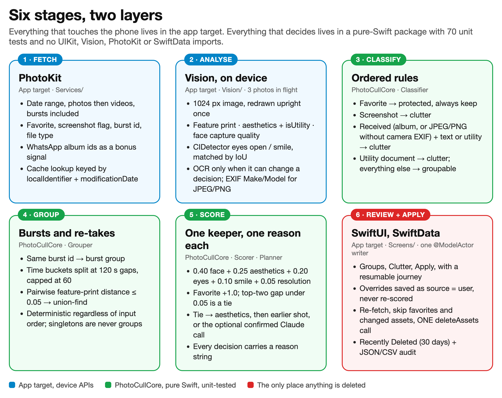
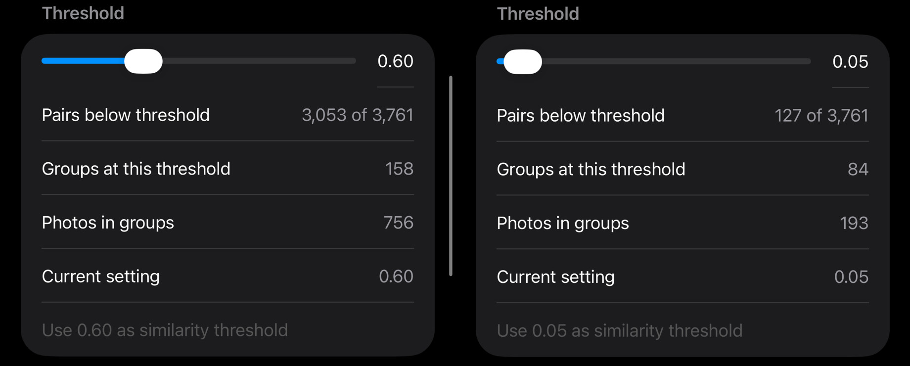
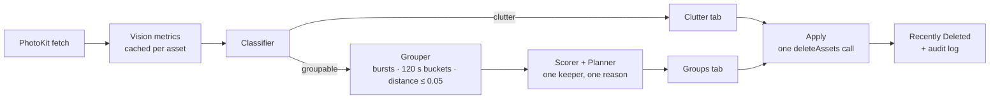

# PhotoCull

On-device photo culling for iPhone. Scan a date range, group bursts and re-takes of the same moment, pick the best shot in each group with Apple's Vision framework, flag screenshots and WhatsApp clutter, review every decision, then move the losers to Recently Deleted in one tap.

No server, no account, no iCloud, no analytics. The only network call in the app is an optional, off-by-default Claude tie-breaker that you have to turn on, give a key to, and confirm per batch.

Built spec first for two phones (an iPhone 17 Pro Max on iOS 27 and an iPhone 15 Pro on iOS 26). The story is in [`docs/ARTICLE.md`](docs/ARTICLE.md); the technical deep dive with timings, calibration data and the market comparison is in [`docs/DEEP-DIVE.md`](docs/DEEP-DIVE.md).



## What it does

- **Groups** bursts (same `burstIdentifier`) and re-takes (feature-print distance inside a 120-second window) and picks one keeper per group. The keeper score is 0.40 face capture quality + 0.25 aesthetics + 0.20 eyes open + 0.10 smile + 0.05 resolution, favorites always win, and every decision carries a one-line reason you can read in the app.
- **Flags clutter**: screenshots, WhatsApp forwards (album membership or a JPEG/PNG with no camera EXIF), text-heavy or utility images such as receipts and documents, screen recordings, received videos, and your largest videos with sizes.
- **Videos**: exact duplicates by duration, size and dimensions across any time span; same-take similarity from three sampled frames inside a time bucket. Never downloads from iCloud.
- **Review first**: Groups and Clutter tabs with a score breakdown per photo, Make keeper, Keep all, Delete all but keeper, per-section Select all. Your overrides are saved as user decisions and never re-scored on a later scan.
- **Resumable**: a journey card on the Scan tab remembers where you stopped, even days later.
- **Apply**: one confirmed action moves the delete list to Photos' Recently Deleted (30-day undo) and writes an audit entry you can export as JSON or CSV.
- **Calibrate**: a histogram of every compared pair's distance with a threshold slider and a live group preview, so the similarity threshold is measured on your library rather than guessed.

## The threshold you have to measure

The spec started with a feature-print distance of 0.6, a number that floats around older Vision write-ups. On iOS 26 that grouped 81 percent of all compared pairs in a 993-photo library: whole afternoons collapsed into single groups. The Calibrate screen made the problem visible and 0.05 turned out to be the value that keeps only near-identical frames. It is now the app default, but re-check it after any iOS update, and expect a different value on a different iOS version.



## Safety rules

These are enforced by the code, not by habit. See [`CLAUDE.md`](CLAUDE.md) for the full list.

- `PHAssetChangeRequest.deleteAssets` exists in exactly one place, `ApplyController.apply`, reached only from the Apply screen's confirmed action, as a single `performChanges` call.
- Favorites are never delete candidates, whatever happens inside a group.
- Only assets with a delete decision in the current session are deleted. Each one is re-fetched by `localIdentifier` right before the call and skipped if it is missing or was modified after analysis.
- Groups never have size 1 and never have zero keepers.
- Decisions made by you are never re-scored by a later scan.
- `URLSession` is used in one file, the Claude client. It makes zero calls unless the toggle is on, a key is in the Keychain, and you confirmed the batch. A failed or low-confidence reply never flips a decision to delete.

## Build and run

Requirements: Xcode 26, [XcodeGen](https://github.com/yonaslabs/XcodeGen) (`brew install xcodegen`), an iPhone on iOS 18 or later. Vision quality and scan speed can only be judged on a real phone; the simulator on Xcode 26.6 cannot run the Vision requests at all.

```sh
xcodegen generate                              # PhotoCull.xcodeproj from project.yml (git-ignored)

cd Packages/PhotoCullCore && swift test        # 70 tests, pure Swift, seconds on the Mac

scripts/deploy-phone.sh                        # build, install and launch on the connected iPhone
scripts/deploy-phone.sh --list                 # paired devices and their UDIDs
```

Before building for your own phone, change `bundleIdPrefix`, `PRODUCT_BUNDLE_IDENTIFIER` and `DEVELOPMENT_TEAM` in `project.yml`. Automatic signing handles the rest.

After the first scan: Settings, long-press the version number, Debug, Calibrate. Pick a burst you know and check it groups; pick two different scenes shot a minute apart and check they do not.

## Layout

```
Packages/PhotoCullCore/    pure Swift: Thresholds, Classifier, Grouper, Scorer, Planner, Video*, TieBreakVerdict
PhotoCull/App/             app entry, permission gate, five-tab shell, navigation
PhotoCull/Services/        PhotoKit, scan controller, persistence actor, review, apply, audit, Claude client, log
PhotoCull/Vision/          feature extraction for photos and videos
PhotoCull/Persistence/     SwiftData models
PhotoCull/Screens/         SwiftUI screens
PHOTOCULL_SPEC.md          the spec the app was built from (section numbers are referenced in code)
docs/                      article and figures
```

The full pipeline, stage by stage, is in [`docs/images/pipeline.png`](docs/images/pipeline.png). The Core package never imports UIKit, Vision, PhotoKit or SwiftData. `Planner(thresholds:).plan(metrics:distance:)` takes metrics plus a `(id, id) -> Float?` distance closure and returns classifications, scored groups and one proposed decision per asset. That boundary is what makes the decision logic testable with synthetic fixtures.



## The optional Claude tie-breaker

When the top two photos in a group score within the tie margin, the app can ask Claude which one to keep. It is off by default and the button does not render unless the toggle is on and a key is stored in the Keychain. Before any call you see the number of photos and an estimated cost and have to confirm. Images go as 768-pixel JPEGs, at most six per group, and the reply can only move the keeper inside the tie. Settings has a Test connection button that checks the key without spending tokens. Typical cost is well under a cent per group with `claude-sonnet-5`.

## Known gaps

No blur detection, no video or Live Photo compression, no swipe-to-decide mode, no App Store build. Received photos and documents default to keep and delete respectively; both are a setting.

## License

MIT. See [LICENSE](LICENSE).
