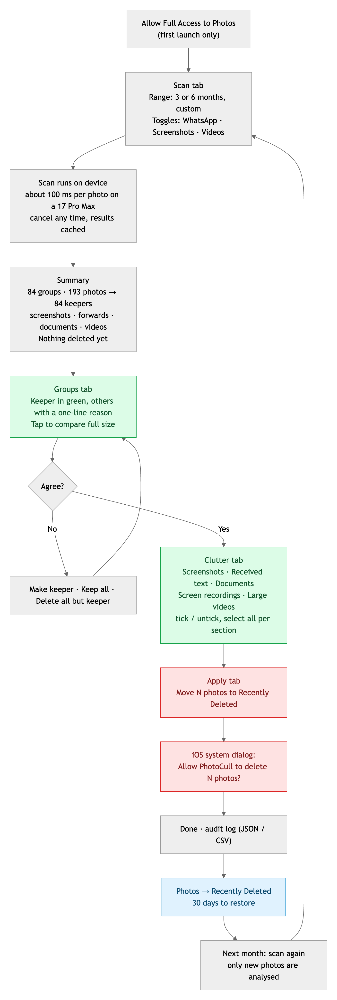
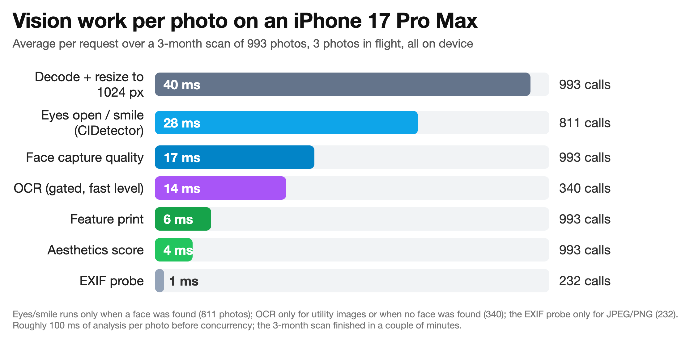
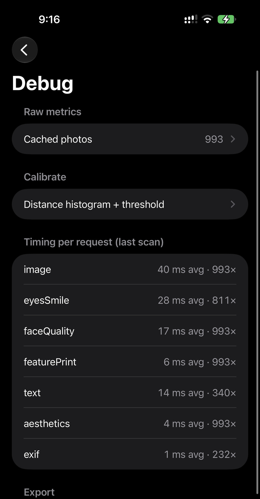
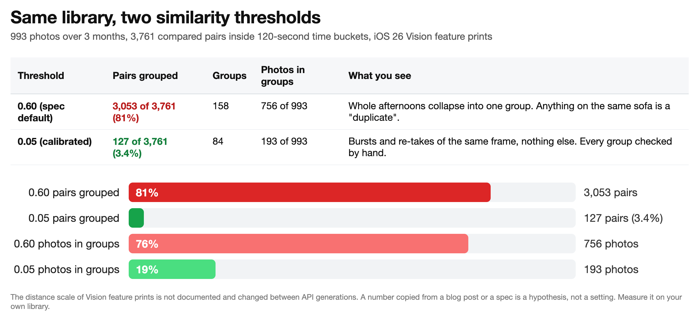
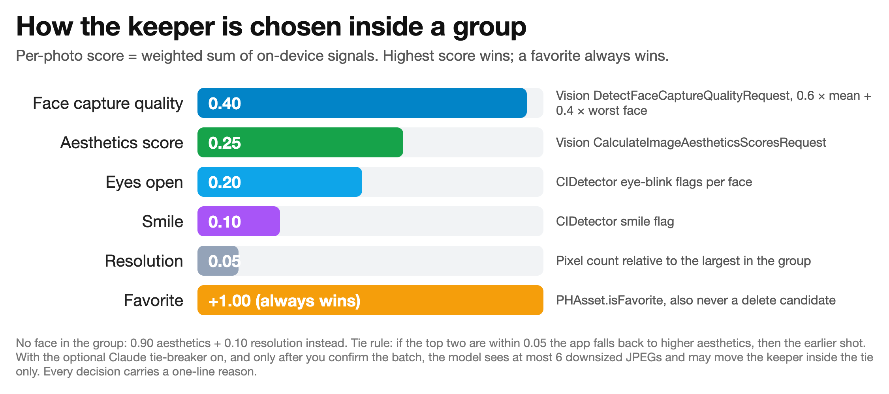
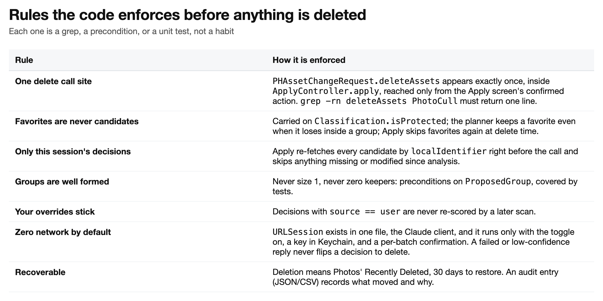
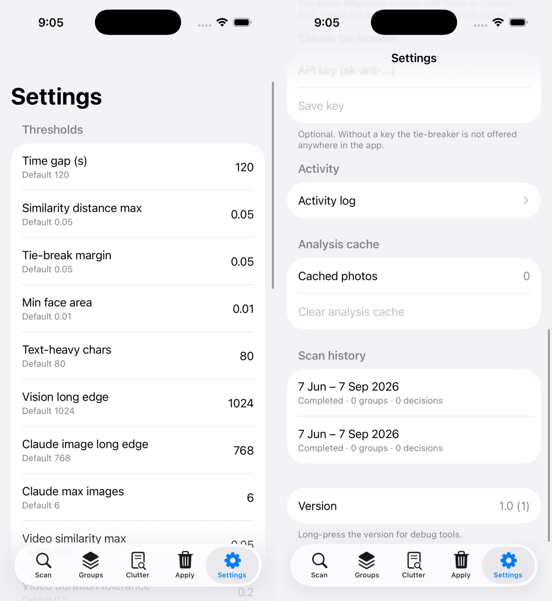
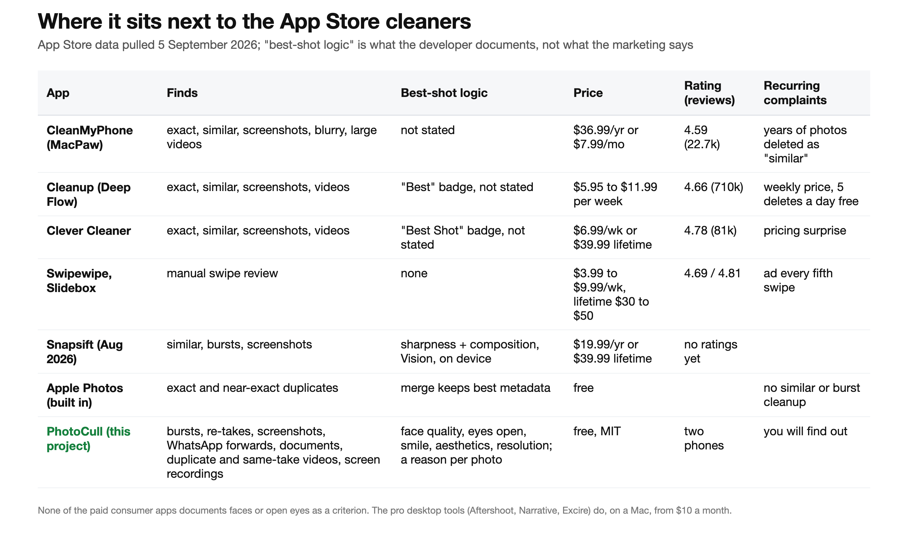

# Culling a thousand iPhone photos on-device with Apple Vision (and the similarity threshold nobody documents)

*A weekend build with Claude Code: bursts grouped by feature prints, keepers picked by face quality and open eyes, WhatsApp clutter flagged, and nothing deleted without a reason next to it.*

---

Three months of a new baby produced 993 photos on my phone. Most of them were bursts of the same moment, WhatsApp forwards from the family group, screenshots of things I no longer needed, and the occasional receipt. The photos I wanted were in there. Finding them meant swiping through everything else.

I tried the App Store. The category is a wall of "cleaner" apps that charge by the week, hide how they decide what is a duplicate, and have one-star reviews about years of photos vanishing because "similar" meant "same sofa". Apple's own Duplicates album only catches exact copies. Nothing I found would tell me *why* it picked one shot over another, and none of them treated a photo of a person any differently from a photo of a wall.

So I built one. It runs entirely on the phone, explains every decision, and moves nothing anywhere except Photos' own Recently Deleted. The code is on GitHub under MIT: **[github.com/GauravJiandaniGJ/photocull](https://github.com/GauravJiandaniGJ/photocull)**. This is what it does, what Apple's frameworks gave me for free, and the one number that turned out to be wrong by an order of magnitude.

## What it does

Scan a date range. The app groups bursts and re-takes, picks one keeper per group, flags the clutter, and then waits. You review the groups, review the clutter, and press Apply once. The whole flow is a journey you can leave and come back to days later.



Every delete decision has a one-line reason next to it: "Lower face quality (0.61 vs 0.84)", "1 face with eyes closed", "Screenshot", "Received image with text/document content". You can tap any photo in a group and make it the keeper, keep the whole group, or delete everything but the keeper. Those overrides are stored as your decisions and a later scan never touches them.

## Six stages, two layers


The app is split along one hard boundary. Everything that touches the device, PhotoKit, Vision, Core Image, SwiftData, the UI, lives in the app target. Everything that *decides* lives in a pure-Swift package with no UIKit, Vision, PhotoKit or SwiftData imports. The package has 70 unit tests that run on the Mac in seconds with `swift test`, using synthetic metrics.

The whole decision pipeline is one call:

```swift
let plan = Planner(thresholds: thresholds).plan(
    metrics: metrics,                    // [AssetMetrics], one per photo
    distance: { a, b in extractor.distance(a, b) }  // feature-print distance, or nil
)
// plan.classifications, plan.groups (each with a keeper and reasons), plan.decisions
```

The grouper never sees a feature print. It asks a closure for the distance between two ids, and the app answers from prints it keeps in memory for the duration of one scan. That is the trick that makes the grouping logic testable with fake distances and keeps the 2,000-float vectors out of the database.

## What Vision gives you for free

The analysis per photo is four Vision requests, one Core Image detector, and an EXIF probe. All of it ships in iOS 18 and later. No models to download, no per-photo cost.

```swift
let handler = ImageRequestHandler(cgImage)

let print      = try await handler.perform(GenerateImageFeaturePrintRequest())
let aesthetics = try await handler.perform(CalculateImageAestheticsScoresRequest())
let faces      = try await handler.perform(DetectFaceCaptureQualityRequest())

var text = RecognizeTextRequest()
text.recognitionLevel = .fast
let lines = try await handler.perform(text)          // only when it can change a decision
```

- **`GenerateImageFeaturePrintRequest`** returns a vector you can compare with `distance(to:)`. Two photos of the same moment are close, two different scenes are far. What "close" means numerically is the subject of the next section.
- **`CalculateImageAestheticsScoresRequest`** returns an overall score between -1 and 1 and an `isUtility` flag. The flag is the useful part: it fires on receipts, documents, whiteboards and memes, which is most of the clutter I wanted gone.
- **`DetectFaceCaptureQualityRequest`** gives each face a capture-quality score. It is Apple's own "is this a good photo of this face" signal, and it is the single strongest input to the keeper choice.
- **`CIDetector`** with `CIDetectorEyeBlink` and `CIDetectorSmile` tells you whether each eye is open and whether the person is smiling. Vision has no eye-state request, so the app runs both and matches CIDetector faces to Vision faces by bounding-box overlap. One redraw of the image upright puts both APIs in the same coordinate system.
- **EXIF** tells you where a JPEG came from. WhatsApp strips the camera make and model when it re-encodes an image, so "JPEG or PNG with no camera EXIF" is a reliable received-photo signal even when the WhatsApp album is missing. HEIC is assumed to be from the camera because WhatsApp never delivers HEIC.

Here is what that costs on an iPhone 17 Pro Max, averaged over the 993-photo scan:





Decoding and resizing the image to 1,024 pixels is the most expensive step. The Vision requests themselves are cheap: feature print 6 ms, aesthetics 4 ms. OCR runs only when it can change a decision (utility image, no face, or a received photo), which is why it ran on 340 photos rather than 993. The scan runs three photos in flight and keeps everything scalar in a SwiftData cache keyed by `localIdentifier` and `modificationDate`, so the second scan of the same range only touches new photos.

## The threshold nobody documents

Grouping is simple on paper. Photos with the same `burstIdentifier` are a burst. Everything else is sorted by time, split into buckets wherever the gap exceeds 120 seconds, and inside each bucket every pair is compared by feature-print distance. Pairs under the threshold are joined with union-find. Singletons are never groups.

The spec I wrote said the threshold was 0.6. That number comes from older write-ups of the feature-print API. Apple does not document the scale of the distance at all, and it changed between API generations.

On iOS 26, 0.6 was a disaster. Of 3,761 compared pairs, 3,053 fell under it. Whole afternoons collapsed into single groups, and the group preview showed a baby on a mat next to a baby on a bed next to a birthday cake, all "duplicates".


The fix was not a better number from a better blog post. It was a screen. The Calibrate view draws a histogram of every compared pair's distance, puts a slider on it, and shows the groups that would form at that value, newest first. Drag the slider, look at the groups, drag again. On my library the histogram had a tall spike near zero and a long flat tail, and 0.05 was the value that kept the spike and dropped the tail: 127 pairs, 84 groups, 193 photos, every one of them a burst or a re-take of the same frame.



The lesson generalises. A similarity threshold copied from anywhere is a hypothesis about someone else's phone, someone else's iOS version and someone else's photos. Build the instrument first, then read the number off it. The app keeps the histogram behind a debug menu so I can re-check after every iOS update.

## Picking the keeper

Inside a group, each photo gets a score from the signals above.



Face quality is a blend of the mean and the worst face in the frame, so a group photo where one person blinked loses to the one where everyone is sharp. When the group has no faces, aesthetics takes 90 percent of the weight and resolution the rest. A favorite gets a bonus of 1.0 and simply wins.

If the top two are within 0.05 of each other it is a tie. The local rule is higher aesthetics, then the earlier shot. There is an optional Claude tie-breaker for exactly this case, described below, but the scoring above decided every group in my library without it.

The reason strings come from the same numbers. The scorer looks at which term cost the loser the most and writes that down: "Lower face quality (0.61 vs 0.84)", "2 faces with eyes closed", "Lower overall quality", "Fewer smiles", "Lower resolution", or for a genuine tie, "Near-identical; keeper was taken first". The group detail screen shows the full breakdown per photo, so when the app is wrong you can see why it was wrong and correct it.

## The rules that keep it safe

Deleting photos is the one thing this app must never get wrong. The rules are enforced by structure, not by care.



Two of them are literally greps that must return one line each:

```sh
grep -rn deleteAssets PhotoCull    # exactly one call site: ApplyController.apply
grep -rn URLSession PhotoCull      # exactly one file: the Claude client
```

Apply re-fetches every candidate by identifier right before the call and skips anything missing, modified since analysis, or favorited in the meantime. Then it makes a single `performChanges` call, iOS shows its own confirmation dialog, and the photos land in Recently Deleted with 30 days to change your mind. An audit entry records what moved and why, exportable as JSON or CSV.

## The optional Claude tie-breaker

Sometimes two photos really are equally good and you want a second opinion. The app can send the tied photos to Claude and ask which one to keep, with a reason. Three things had to be true before I was comfortable with that:

1. It is off by default, and the button does not render unless the toggle is on **and** a key is stored in the Keychain.
2. Before any call you see a dialog with the number of photos and an estimated cost, and you confirm that specific batch.
3. The reply can only move the keeper *inside the tie*. A failed call, a low-confidence answer, or a malformed reply changes nothing.



Images go as 768-pixel JPEGs, at most six per group. A 768-pixel photo is roughly 590 input tokens, so a two-photo tie costs around 0.4 cents with `claude-sonnet-5` and less with Haiku. Settings has a Test connection button that checks the key with a request that spends no tokens. In practice I have not needed it; the local scoring was right often enough.

## Videos too

Videos got the same treatment with different signals. Exact duplicates are found by duration, file size and dimensions across any time span. Same-take similarity samples three frames at 10, 50 and 90 percent with `AVAssetImageGenerator` and compares their feature prints inside a time bucket. Screen recordings are recognised by exact iPhone screen dimensions. The app never downloads a video from iCloud to analyse it; a non-local video gets no frames and shows up only in the largest-first list with its size.

## How it was built

I wrote this with [Claude Code](https://claude.com/claude-code) over two days, 5 to 7 September 2026. The repo is 60 Swift files, about 5,500 lines, 15 commits, 70 tests. I did not type most of the code. What I did was the part that decided whether the app would be any good:

- **Spec first.** `PHOTOCULL_SPEC.md` is 270 lines: what the app does, the pipeline, every threshold, the safety rules, the data model, the milestones, and a section of decisions the owner has to make rather than the model guess (the WhatsApp album title, what to do with received photos, when to ship the tie-breaker). Every file in the repo references a spec section.
- **`CLAUDE.md` as institutional memory.** Build commands, the architecture boundary, the calibrated threshold, and the things that are easy to get wrong across files. It was updated after every milestone and it is what let a new session pick up where the last one stopped.
- **A fast loop and a slow loop.** The Core package tests run in seconds on the Mac and caught every scoring and grouping regression. Vision quality can only be judged on a phone, so a script builds, installs and launches on the connected iPhone with `xcodebuild` and `devicectl`. The simulator turned out to be useless for the scan itself: on Xcode 26.6 every Vision request fails with "Failed to create espresso context".
- **Instruments before answers.** The Calibrate histogram, the per-request timings, the raw metrics table and the CSV export were built in milestone 1, before the review UI. They are what turned "0.6 feels wrong" into "0.05, and here is why".

Things that bit: Swift strict concurrency warnings around `AVAsset` and SwiftData predicates, `xcodebuild test` timing out in the simulator (so `swift test` is the only test route), Swift Charts bars that were invisible on a numeric axis until they got explicit start and end values, and a group detail row that pushed all its text off-screen when a group had 14 members.

What it cost: a Claude Code subscription and the Apple Developer Program I already pay for. Per photo, nothing. All of the analysis is Apple frameworks on the phone.

## Where it sits



I do not think this is a business. The category is owned by apps with hundreds of thousands of reviews and ad budgets, and the newest one built on the same Vision APIs launched last month to no ratings at all. What it is: a photo culler that shows its work, costs nothing, sends nothing anywhere, and can be read end to end in an afternoon.

Missing, if you want to pick it up: blur detection (Vision has no request for it; a Laplacian variance would do), video and Live Photo compression, a swipe mode for people who prefer to decide by hand, and an App Store build.

## Try it

Clone the repo, change the team and bundle id in `project.yml`, run `xcodegen generate`, and deploy to your phone. Then, before you trust a single group, open Settings, long-press the version number, and calibrate. Your number will not be my number. That is the point.

**[github.com/GauravJiandaniGJ/photocull](https://github.com/GauravJiandaniGJ/photocull)**, MIT.
